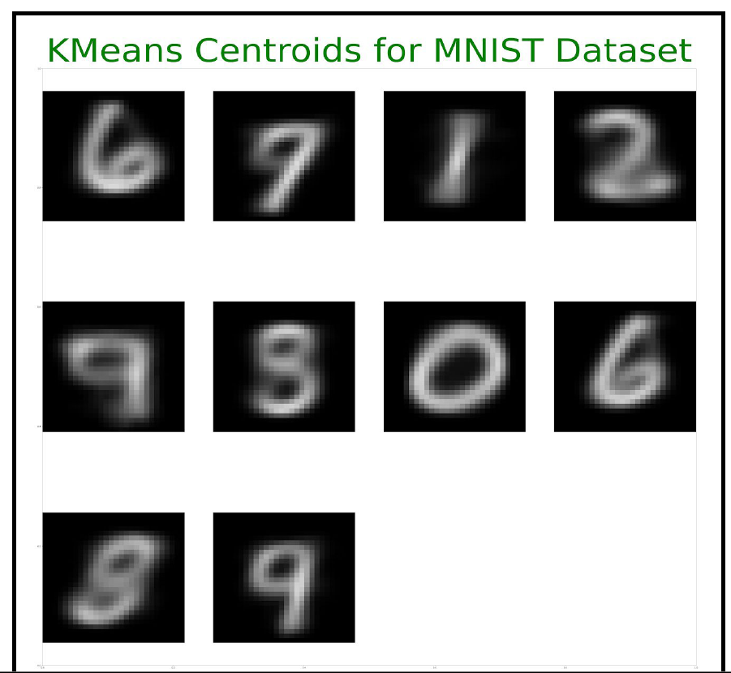
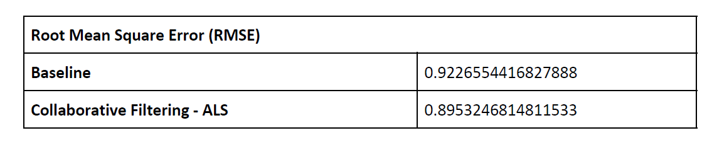

# Scalable Data Science- Technical University of Berlin

The goal of the project is to process various data using various data mining tasks with Scala and Apache Spark.

### Tools
* Language: Scala, Java, Python
* IDE: IntelliJ IDEA, Google Colab
* Build tool: Maven
* Apache RDDs, Spark DataFrames and GeoSpark Spatial RDDs

The project is decomposed into the following sub tasks

### [1. Classification](https://github.com/htefera/Scalable-Data-Science-Assignment-2/tree/master/Classification)

The goal is to classify email texts as spam or not. To do so, we use logistic regression and SVM algorithms and compare their accuracies. 

Approach

1. We read the CSV files as dataframe and add a column “spam” to denote if the read record is spam or not
1. We union training records for spam and no spam into a single dataframe, the same operation is done for the training set too.
1. We normalize the email text, we apply normalization as we term frequency as the basis
for classification and having discrete email addresses,
2. We construct a pipeline to apply the transformation. We perform word tokoneziation the words and stop word removal operation. We use a hashing term frequency transform to count the word occurrences and we calculate the inverse document frequency and this forms our feature vector.
3.  We train a Logistic Regression and SVM model with transformed training data
4.  We use the testing set to make predictions using the model
5.  We compute RoC, Accuracy, Precision and Recall metrics and display a confusion matrix for the benefit of the user

### [2. Clustering](https://github.com/htefera/Scalable-Data-Science-Assignment-2/tree/master/Clustering)
The goal is to apply k means clustering  on MNIST handwritten numbers dataset.

Approach Clustering

1. Read the mnist CSV files as raw text files
2. Convert each line into a Row of dense vectors
3. Create a dataframe from RDD from step 2
4. Since the grayscale values can range from 0 to 255 and we don’t want to give undue weightage during distance computation, we apply mean scaling
5. Scaled dataset is used to training the developed K-Means model
6. We set the number of clusters as 10 based on intuition, there are 10 numbers (0-9) and the aim was to see if vectors with the same image are clustered together
7. The final centroid values are scaled back and written to a CSV file

After we classify the handwritten datasets, the next task is to visualize the centeroids 

Centroid Visualization
1. We read the centroids CSV file
2. Create a matplotlib plot with 10 subplots within it, one for each centroid
3. We reshape the flattened MNIST data into 28x28 numpy array
4. This array is then projected as a grayscale image
5. The plot is saved

The generated centroids are shown below

 

  Figure : Cenroid classification
  

  

### [3. Recommednation System](https://github.com/htefera/Scalable-Data-Science-Assignment-2/tree/master/Recommendation%20Systems)

The goal of the task is for creating a movie recommender system. 
Exploration
1. We read the movies and ratings csv files into dataframes
2. Join movies and rating dataframes on movieId column to get movieRating dataframe. 
3. We perform the following exploartion before we actually develop the recommendation system to understand the data
* Printing the names of the top-10 movies with the largest number of ratings
* Printing the names of the top-10 movies with the highest average rating grouped by genre
* Finding the common support for all pair of the first 100 movies 
For developing the recommender system we apply Baseline Predictor and Collaborative Filtering algorithms

#### Baseline Predictor

We build a model that implements Spark’s model abstraction. We approached the problem as follows
1. We compute the mean ratings for all movie
2. For each user, user bias is the difference between overall average ratings and average user rating
3. For each movie, movie bias is the difference between overall average ratings and average movie rating
4. Baseline model is created with overall means, user and movie bias

#### Collaborative Filtering
1. Spark supports Alternating Least Squares (ALS) matrix factorization for collaborative filtering
2. We initialize ALS with 50 maximum iterations and 25 latent factors
3. We instruct spark to checkout frequently to avoid StackOverFlow exception resulting from deep recursions performed by ALS

#### Evaluation 
In order to see the recommednation accuracy we need to evaluate both models. For model evaluation we approached as follows

1. We randomly split the rating dataset into train (70%) and test sets (30%)
2. Training the models using training set
3. We use the test set to make predictions
4. We use regression evaluator to calculate root mean square error

 Figure : RMSE of Baseline Predictor Vs Collaborative filtering
 

 
 
Recommendations
As we can see from above, since the ALS model has the lowest RMSE we use it for recommending best movie for all
users.  

### [4. Spatial Data Analysis](https://github.com/htefera/Scalable-Data-Science-Assignment-2/tree/master/Spatial%20Data%20Analysis)

